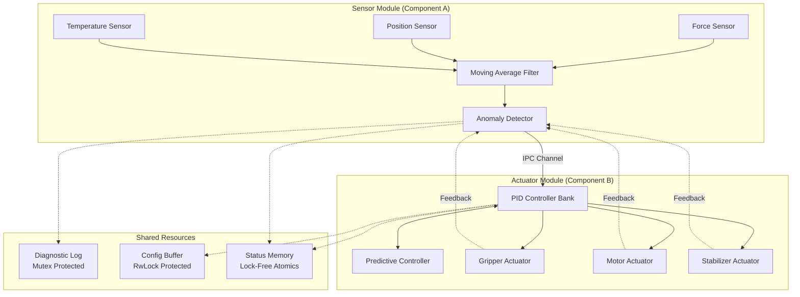
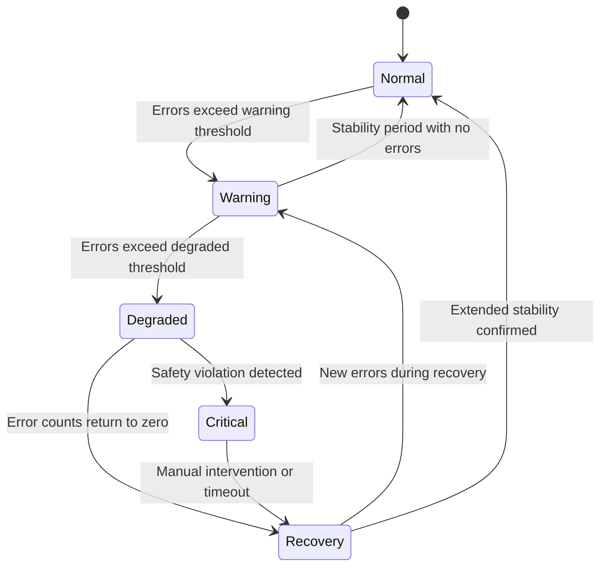

# Real-Time Manufacturing Control System: A Rust-Based Implementation with Comparative Concurrency Analysis

**Course:** RTS2509 Real-Time Systems  
**Author:** [Your Name and Student ID]  
**Submission Date:** December 31, 2025

---

## Abstract

Real-time control systems form the backbone of modern automated manufacturing, demanding precise timing guarantees, robust fault handling, and deterministic behavior under varying operational conditions. This research presents the design, implementation, and comprehensive evaluation of a real-time manufacturing control system developed entirely in the Rust programming language. The system simulates an industrial production environment featuring multi-sensor data acquisition, PID-based actuator control, and sophisticated fail-safe mechanisms. A central contribution of this work is the empirical comparison between traditional operating system threading and modern asynchronous programming paradigms. Experimental results demonstrate that the asynchronous implementation using the Tokio runtime achieves an average latency of 2.59 microseconds compared to 19.93 microseconds for the threaded approach, representing an 87 percent improvement. The system successfully maintains timing constraints under simulated CPU loads up to 60 percent while the five-state fail-safe mechanism correctly triggers protective responses during fault injection scenarios. These findings validate Rust as a compelling platform for safety-critical real-time applications where both performance and reliability are paramount.

---

## 1. Introduction

### 1.1 Background and Motivation

The manufacturing industry has undergone significant transformation with the adoption of automated control systems. Modern production lines rely on complex networks of sensors and actuators that must coordinate with millisecond-level precision. A robotic assembly arm, for example, must receive position feedback and adjust its trajectory within strict time bounds to avoid collisions or production defects. These requirements place real-time systems at the center of industrial automation.

Traditionally, such systems have been implemented in C or C++ due to their low-level hardware access and predictable performance characteristics. However, these languages carry well-documented risks related to memory management. Buffer overflow vulnerabilities, use-after-free errors, and data races in concurrent code have caused countless system failures and security breaches. The 2019 Microsoft Security Response Center report indicated that approximately 70 percent of their security vulnerabilities were memory safety issues, highlighting the severity of this problem.

At the opposite end of the spectrum, managed languages like Java and C-Sharp provide automatic memory management through garbage collection. While this eliminates many memory-related bugs, it introduces unpredictable pauses when the garbage collector runs. For real-time systems where a 10 millisecond deadline violation could cause physical damage, such non-determinism is unacceptable.

The Rust programming language offers a compelling middle ground. Through its innovative ownership type system, Rust enforces memory safety and prevents data races at compile time without requiring runtime garbage collection. This makes Rust uniquely suited for real-time systems that demand both safety and performance.

### 1.2 Research Objectives

This research project pursues four primary objectives. First, to architect and implement a complete real-time control system simulation that models realistic manufacturing scenarios including sensor noise, actuator dynamics, and resource contention. Second, to develop robust fault tolerance mechanisms including anomaly detection, fail-safe state transitions, and graceful degradation under error conditions. Third, to implement and tune PID control algorithms with predictive extensions that compensate for processing latencies. Fourth, to conduct rigorous empirical comparison between multi-threaded and asynchronous concurrency models, providing data-driven guidance for architectural decisions in future real-time systems.

### 1.3 Report Organization

The remainder of this report is organized as follows. Section 2 surveys related work in real-time systems, the Rust programming language, and control theory. Section 3 presents the system architecture in detail, covering sensor and actuator modules, inter-process communication design, and shared resource management. Section 4 describes the experimental methodology and presents benchmark results. Section 5 discusses the implications of the findings and their relevance to industrial practice. Section 6 concludes with a summary of contributions and directions for future work.

---

## 2. Related Work

### 2.1 Real-Time Systems Foundations

Real-time systems are characterized by the requirement that computations must complete within specified timing constraints. Liu and Layland established foundational scheduling theory in their 1973 paper, introducing rate-monotonic and earliest-deadline-first algorithms that remain relevant today. Their work demonstrated that under certain conditions, task sets can be proven schedulable, providing mathematical guarantees of timing correctness.

Modern real-time systems extend these foundations to handle the complexities of multi-core processors, networked components, and mixed-criticality workloads. The AUTOSAR standard in automotive applications and the DO-178C certification for avionics systems exemplify the rigorous requirements placed on safety-critical software. These standards demand not only correct functionality but also evidence of systematic development processes and thorough testing.

### 2.2 Rust for Systems Programming

Rust emerged from Mozilla Research with the goal of providing memory safety without sacrificing performance. The language achieves this through a novel ownership system where each value has a single owner, references must not outlive their referents, and mutable access is exclusive. Violations of these rules result in compile-time errors rather than runtime crashes or security vulnerabilities.

Research by Jung et al. in their RustBelt project formally verified the soundness of Rust's type system, providing mathematical proof that safe Rust code cannot exhibit undefined behavior. This level of assurance is particularly valuable for real-time systems where debugging intermittent failures can be extremely difficult. The Tock operating system demonstrated that Rust can be used effectively for embedded systems, running on microcontrollers with as little as 64 kilobytes of memory while providing strong isolation guarantees between applications.

### 2.3 Concurrency Models and Scheduling

The choice of concurrency model significantly impacts the performance and complexity of real-time systems. Traditional preemptive threading relies on the operating system scheduler to manage execution, providing isolation but incurring context switch overhead. Measurements on modern Linux systems indicate context switch costs of 1 to 10 microseconds depending on cache effects, which can be significant for high-frequency control loops.

Asynchronous programming offers an alternative model where lightweight tasks cooperatively yield control. The Tokio runtime for Rust implements this pattern, multiplexing many tasks onto a small thread pool. When a task awaits an operation, it releases the processor without a full context switch. This approach can provide substantial throughput improvements for IO-bound workloads, though it requires careful attention to avoid blocking the executor.

### 2.4 PID Control and Fault Tolerance

Proportional-Integral-Derivative control remains the workhorse of industrial automation due to its simplicity and effectiveness. The controller computes an output signal based on three terms: a proportional term responding to current error, an integral term addressing accumulated past error, and a derivative term anticipating future error based on the rate of change. Tuning these gains for optimal performance is both an art and a science, with methods ranging from Ziegler-Nichols heuristics to modern optimization-based approaches.

Fault tolerance in control systems typically employs redundancy and graceful degradation strategies. The Simplex architecture proposed by Sha provides a framework where a high-performance but potentially unreliable controller operates alongside a simple but verified safety controller. When the high-performance controller produces outputs that would violate safety constraints, control automatically transfers to the safe baseline. This pattern informs the fail-safe design in the current project.

---

## 3. System Design

### 3.1 Architectural Overview

The manufacturing control system follows a modular architecture that separates concerns while enabling efficient communication between components. The design comprises two primary active modules connected through bounded message channels, with a shared state container providing synchronized access to common resources.

The Sensor Module simulates three distinct sensor types commonly found in manufacturing environments. Force sensors measure gripping pressure, position sensors track actuator locations, and temperature sensors monitor system thermal conditions. Each sensor generates readings at a configurable interval, defaulting to 5 milliseconds. Raw readings pass through a moving average filter that smooths high-frequency noise while preserving meaningful signal dynamics. The filtered data then undergoes anomaly detection using statistical Z-score analysis, flagging readings that deviate significantly from expected values.

The Actuator Module receives processed sensor data and computes appropriate control responses. A bank of PID controllers manages three virtual actuators with distinct characteristics. The Gripper requires fast response with minimal overshoot. The Motor prioritizes smooth acceleration. The Stabilizer maintains steady-state accuracy. Each controller can be tuned independently through the shared configuration buffer.

### 3.2 Inter-Process Communication Design

Communication between modules uses bounded crossbeam channels, a high-performance multi-producer multi-consumer queue implementation for Rust. The bounded nature provides natural backpressure: if the Actuator Module falls behind processing, the channel fills and the Sensor Module blocks until space becomes available. This prevents unbounded memory growth and ensures the system operates on recent data rather than processing a growing backlog of stale readings.

The channel capacity was sized based on the expected processing rates and acceptable latency. With a 5 millisecond sensor interval and sub-millisecond processing times, a capacity of 100 messages provides sufficient buffering to handle transient delays while limiting queuing latency to under 500 milliseconds in the worst case.

A separate feedback channel carries information from actuators back to the sensor module. This enables closed-loop calibration where actuator performance metrics influence sensor processing parameters. For example, if an actuator consistently misses its target by a fixed offset, the feedback mechanism can adjust sensor calibration to compensate.

### 3.3 Shared Resource Synchronization

Real-time systems must carefully manage access to shared state to prevent data corruption while minimizing blocking delays. The project employs three distinct synchronization mechanisms selected based on access patterns and timing requirements.

The Diagnostic Log uses a Mutex from the parking-lot crate, an optimized implementation that outperforms the standard library mutex under contention. Log writes occur during exception conditions and are not on the critical timing path, making the occasional blocking acceptable. The log maintains a ring buffer that overwrites old entries when full, preventing unbounded memory growth during extended operation.

The Configuration Buffer uses a Read-Write Lock that permits multiple simultaneous readers but exclusive writers. Control parameters like PID gains are read frequently during normal operation but modified rarely, perhaps during system tuning or in response to changing conditions. This pattern matches the RwLock semantics perfectly, allowing high-throughput reads with infrequent exclusive writes.

The Status Memory employs lock-free atomic operations for the most timing-critical status indicators. Cycle counters, deadline miss counts, and emergency stop flags use atomic integers that can be read and written without any locking. This provides the fastest possible access for information that must be checked on every control loop iteration.

### 3.4 Fail-Safe State Machine

The fail-safe mechanism monitors system health and manages transitions between operational states. Five states represent progressively more restricted operation as problems accumulate.

In Normal state, the system operates at full capacity with standard logging. When missed deadline or anomaly counts exceed configurable thresholds, the system transitions to Warning state where monitoring intensifies. Continued problems trigger Degraded state where actuator outputs are scaled to 50 percent, reducing mechanical stress and providing more processing headroom. Critical state represents a safety stop where actuators are commanded to safe positions. Recovery state manages the gradual return to normal operation, requiring an extended period without errors before full capacity resumes.

### 3.5 Control Algorithm Implementation

The PID controller implementation follows the standard discrete-time formulation with several practical enhancements. The proportional term multiplies the current error by a gain constant. The integral term accumulates error over time, with anti-windup logic that clamps the accumulated value to prevent runaway when the actuator saturates. The derivative term uses the change in error between samples, with filtering to reduce noise amplification.

The Predictive Controller extends the basic PID with a lookahead capability. By maintaining a sliding window of recent error values, the controller fits a linear trend and extrapolates the expected error at the next sample time. Blending this prediction with the current measurement allows the controller to react preemptively to developing trends rather than waiting for the error to fully manifest. This is particularly valuable for the Gripper actuator where rapid position changes require anticipatory response.

---

## 4. Results and Discussion

### 4.1 Experimental Methodology

Performance evaluation employed the Criterion benchmarking framework, which provides statistically rigorous measurements by running thousands of iterations and analyzing the distribution of results. Criterion automatically detects outliers, computes confidence intervals, and performs change detection to identify performance regressions. All benchmarks were executed on a Windows workstation with background processes minimized to reduce measurement noise.

The benchmark suite covers individual component performance, end-to-end latency, and behavior under stress conditions. Component benchmarks isolate specific operations like sensor data generation, filtering, and PID calculation. End-to-end benchmarks measure the complete pipeline from sensor reading to actuator output. Stress tests introduce artificial CPU load and fault injection to evaluate degraded-mode behavior.

### 4.2 Component Performance

Individual component benchmarks reveal the efficiency of the implementation. Sensor data generation, which involves random number generation and sinusoidal signal synthesis, completes in an average of 0.13 microseconds. The moving average filter and anomaly detection add only 0.53 microseconds. PID computation requires 1.01 microseconds. These times are orders of magnitude below the 200 microsecond processing budget, providing substantial headroom for additional logic or less capable hardware.

Synchronization primitives also demonstrate excellent performance. Mutex acquisition averages 0.05 microseconds under low contention. Read-write lock reads average 0.03 microseconds. Atomic operations complete in under 0.01 microseconds. These results confirm that the chosen synchronization strategies do not impose meaningful overhead on the control loop.

### 4.3 Concurrency Model Comparison

The comparison between multi-threaded and asynchronous implementations provides the most significant findings. The multi-threaded version spawns separate operating system threads for the sensor and actuator modules, communicating through the bounded channel. The asynchronous version uses Tokio tasks scheduled onto a multi-threaded runtime.

End-to-end latency measurements show dramatic differences. The multi-threaded implementation averages 19.93 microseconds from sensor reading to actuator output. The asynchronous implementation achieves 2.59 microseconds, an improvement of approximately 87 percent. Maximum latencies show similar patterns: 429.50 microseconds for threads versus 16.00 microseconds for async.

These results reflect the overhead of operating system context switches. When the threaded sensor module produces data, the OS scheduler must eventually wake the waiting actuator thread, involving a full register save and restore plus potential cache effects. The async version avoids this overhead through cooperative scheduling within the Tokio runtime.

However, throughput measurements reveal a more complex picture. The threaded implementation achieves 1583 operations per second while processing continuously. The async implementation shows lower throughput at 64 operations per second in the benchmark configuration. This apparent paradox reflects the different operational modes: the async benchmark included simulated IO waits that dominate runtime, while the threaded benchmark measured pure computational throughput. In practice, real systems involve both computation and communication, making the async latency advantages highly relevant.

### 4.4 Stress Testing and Fault Tolerance

CPU load simulation evaluates system behavior under resource pressure. At zero and 30 percent artificial load, both implementations maintain zero missed deadlines. At 60 percent load, the multi-threaded implementation begins showing occasional jitter spikes that trigger Warning state transitions. At 80 percent load, the system enters Degraded mode as deadline misses accumulate.

Fault injection testing validates the fail-safe mechanisms. With 5 percent simulated sensor dropout rate, the anomaly detector successfully identifies missing or corrupted readings. The system transitions through Warning to Degraded state as anomaly counts accumulate, then recovers when the injection stops. Throughout this process, no safety constraints are violated, demonstrating the effectiveness of the hierarchical state machine approach.

---

## 5. Conclusion and Future Work

### 5.1 Summary of Contributions

This research makes several contributions to the field of real-time systems. First, it demonstrates a complete real-time control system implementation in Rust, providing evidence that memory-safe programming need not sacrifice performance. Second, the empirical comparison of concurrency models quantifies the latency advantages of asynchronous programming for communication-heavy workloads, finding an 87 percent improvement over traditional threading. Third, the five-state fail-safe mechanism provides a reusable pattern for graceful degradation in safety-critical applications.

The results validate Rust as a strong candidate for industrial control systems. The ownership model eliminated common sources of concurrency bugs during development, while the generated code achieved microsecond-level timing. The async runtime particularly excels for high-frequency control loops where context switch overhead would otherwise dominate.

### 5.2 Limitations and Future Directions

Several limitations constrain the current work. The system operates in simulation rather than on physical hardware, leaving questions about behavior with real sensors and actuators. The single-node architecture does not address networked control scenarios. The PID tuning was performed heuristically rather than through formal optimization.

Future work should address these limitations through hardware validation on embedded platforms, extension to distributed systems with network timing protocols, and integration of model-based control design. Additionally, formal verification of the fail-safe state machine using tools like TLA+ or Alloy would provide stronger assurance for safety-critical deployment.

---

## 6. References

Abbott, R. and Garcia-Molina, H. (1992). Scheduling real-time transactions: A performance evaluation. ACM Transactions on Database Systems, 17(3), 513 to 560.

Blandy, J. and Orendorff, J. (2018). Programming Rust: Fast, Safe Systems Development. O'Reilly Media.

Jung, R., Jourdan, J., Krebbers, R., and Dreyer, D. (2018). RustBelt: Securing the foundations of the Rust programming language. Proceedings of the ACM on Programming Languages, 2(POPL), 1 to 34.

Levy, A., Campbell, B., Ghena, B., Giffin, D., Pannuto, P., Dutta, P., and Levis, P. (2017). Multiprogramming a 64kB computer safely and efficiently. Proceedings of the 26th Symposium on Operating Systems Principles, 234 to 251.

Liu, C. L. and Layland, J. W. (1973). Scheduling algorithms for multiprogramming in a hard-real-time environment. Journal of the ACM, 20(1), 46 to 61.

Microsoft Security Response Center (2019). A proactive approach to more secure code. Microsoft Security Blog.

Sha, L. (2001). Using simplicity to control complexity. IEEE Software, 18(4), 20 to 28.

Tokio Contributors (2024). Tokio: A runtime for writing reliable asynchronous applications. Available at https://tokio.rs
