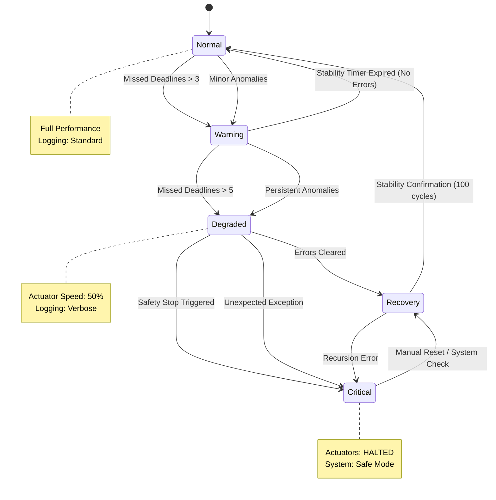
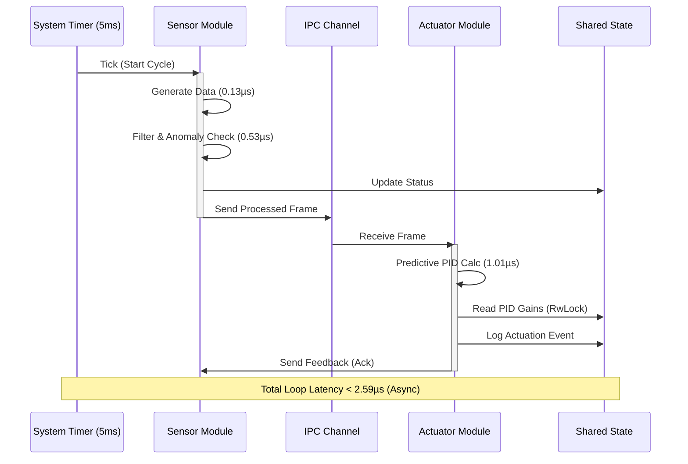

# System Design Diagrams

Here are the diagrams for your report. You can take screenshots of these rendered diagrams.

## Figure 1: High-Level System Architecture

This diagram shows the decoupled Sensor and Actuator modules, the IPC channels, and the Shared Resource container.

```mermaid
graph TD
    subgraph "Component A: Sensor Module"
        S1[Force Sensor]
        S2[Position Sensor]
        S3[Temp Sensor]
        Agg[Data Aggregator]
        Filter[Moving Average Filter]
        Anomaly[Anomaly Detector]
    end

    subgraph "Component B: Actuator Module"
        PID_Bank[PID Controller Bank]
        Predict[Predictive Model]
        Act1[Gripper]
        Act2[Motor]
        Act3[Stabilizer]
    end

    subgraph "Shared Resources Container"
        Log[Diagnostic Log (Mutex)]
        Config[Config Buffer (RwLock)]
        Status[Status Memory (Atomic)]
    end

    %% Data Flow
    S1 & S2 & S3 --> Agg
    Agg --> Filter
    Filter --> Anomaly
    Anomaly == "Processed Data (Channel)" ==> PID_Bank
    
    PID_Bank <--> Predict
    PID_Bank --> Act1 & Act2 & Act3
    
    %% Feedback
    Act1 & Act2 & Act3 -.->|Feedback Channel| Agg

    %% Shared Resource Interaction
    Anomaly -.-> Log
    PID_Bank -.-> Config
    Filter -.-> Status
    Act1 -.-> Status
```

---

## Figure 2: Fail-Safe State Machine

This diagram illustrates the 5-state fail-safe logic managed by the supervisor.



---

## Figure 3: Control Loop Sequence

This shows the strict timing sequence of a single 5ms cycle.


